# My First Repository

## Steps to Follow

| Step | Description                                                                                                                                                                                                                                                                                                                                                                                                                       | Image                                      |
|------|-----------------------------------------------------------------------------------------------------------------------------------------------------------------------------------------------------------------------------------------------------------------------------------------------------------------------------------------------------------------------------------------------------------------------------------|--------------------------------------------|
| 1    | Open a browser window and log in to your [GitHub](https://github.com) account (You must have done that to get here!)                                                                                                                                                                                                                                                                                                              ||
| 2    | On another browser window (or tab) open Canvas, in your Data Structures I class there is an assignment and there should be a link that will take you to the GitHub Classroom                                                                                                                                                                                                                                                      | 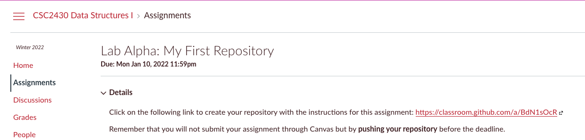 |
| 3    | Once you click the link on the Canvas assignment, it will take you to GitHub classroom, there you can accept the assignment                                                                                                                                                                                                                                                                                                       | 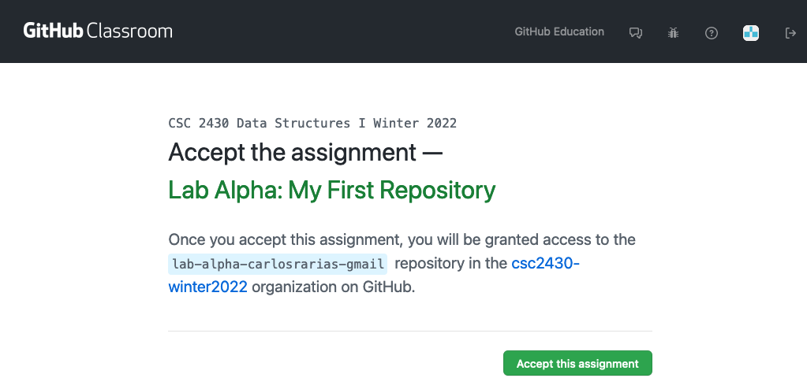     |
| 4    | It will then show you that is creating your repository                                                                                                                                                                                                                                                                                                                                                                            | 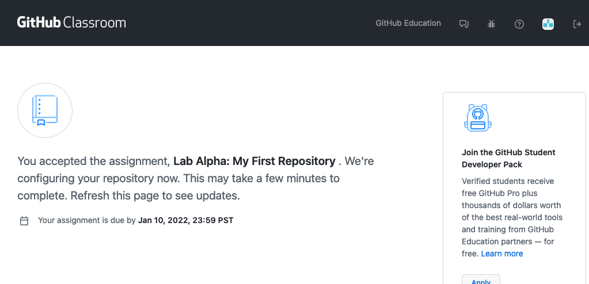           |
| 5    | When you hit refresh it will notify you that your repository has been created. The address of the repository is shown in blue.                                                                                                                                                                                                                                                                                                    | 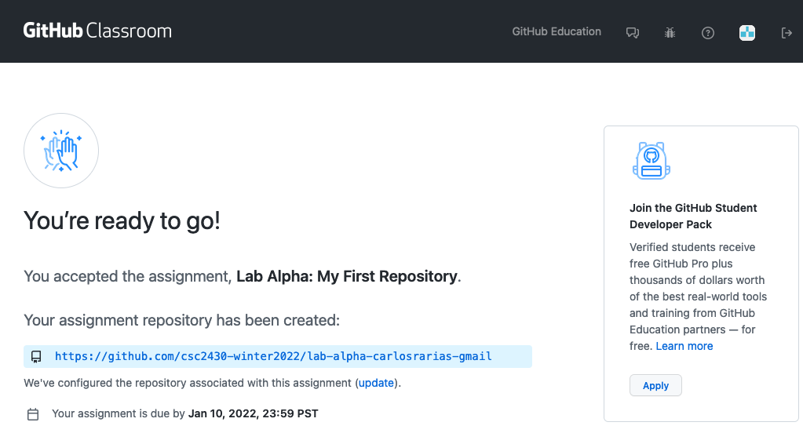          |
| 6    | Click on the repository address that is shown in your "Created Repository" notification, this will take you to GitHub                                                                                                                                                                                                                                                                                                             | 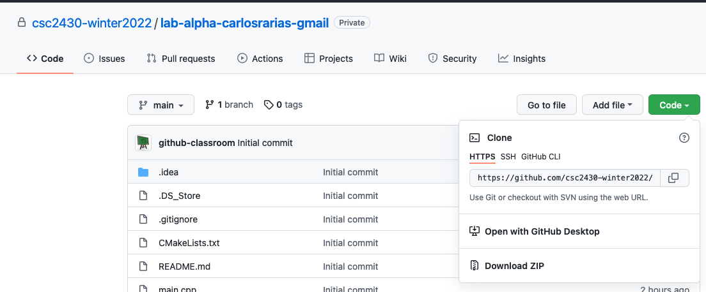             |
| 7    | Click on the button that says "Clone or download", copy the "clone address". Once all the above steps are done, you have a cloud copy of your assignment. Now you need to "connect" this cloud copy to your local computer.                                                                                                                                                                                                       ||
| 8    | To achieve "connecting" your repository to your computer you are going to need to use the [GitHub Desktop](https://desktop.github.com) program. Open the program and login to your GitHub account there                                                                                                                                                                                                                           | 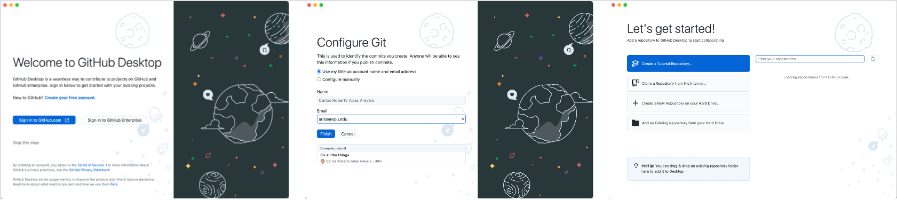         |
| 9    | Using GitHub Desktop application in your computer, clone the repository into your computer. You can do this by going to the Menu that says File and then Clone                                                                                                                                                                                                                                                                    | 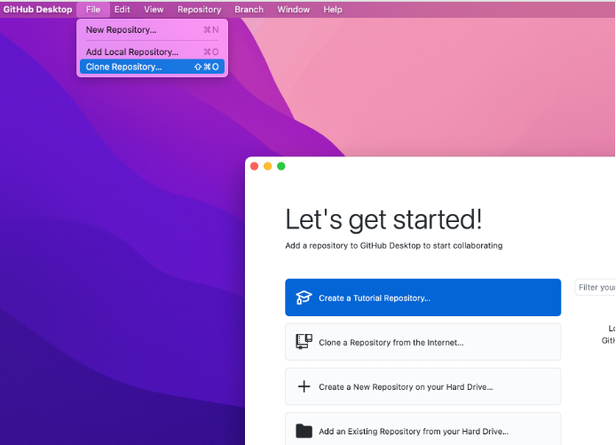          |
| 10   | Copy the URL with the copied url from step 7. Remember to paste it into the URL tab. Enter the local path in your computer, it is recommended that you use the `development` folder that you have created for this purpose. It is **very important** that you remember where you cloned your repository!                                                                                                                          | 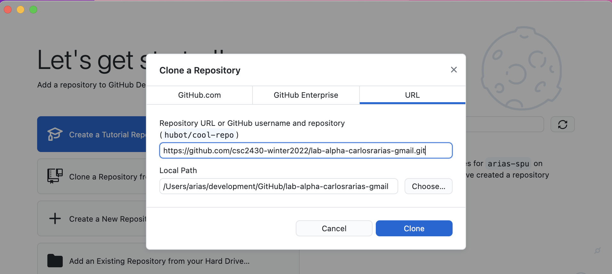         |
| 11   | Once your repository is cloned it will show you the loaded repository on GitHub Desktop.                                                                                                                                                                                                                                                                                                                                          |    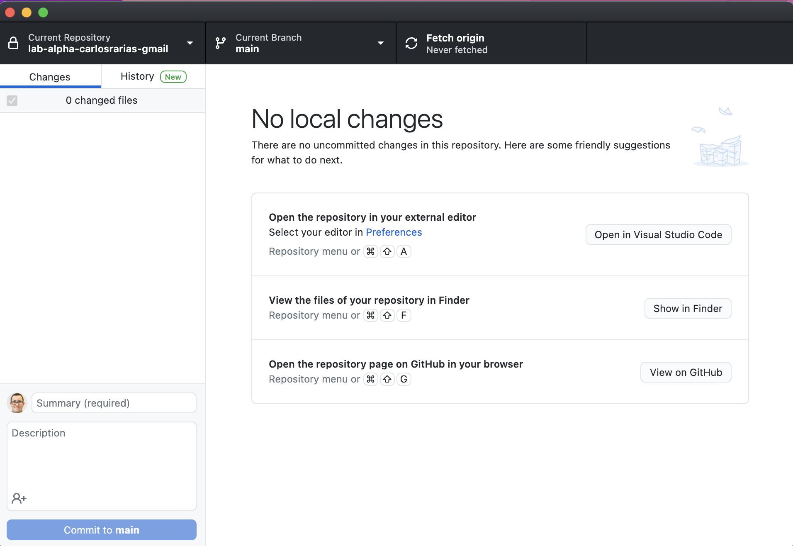 |                                        |
| 12   | Open CLion, open a new project                                                                                                                                                                                                                                                                                                                                                                                                    | 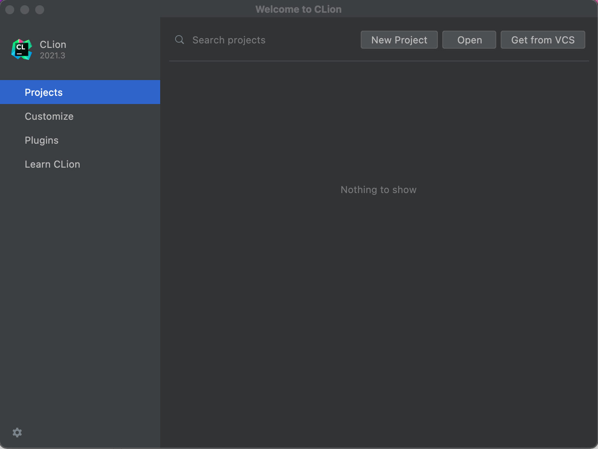          |
| 13   | Open a project using the same directory (folder) where you cloned your repository                                                                                                                                                                                                                                                                                                                                                 | 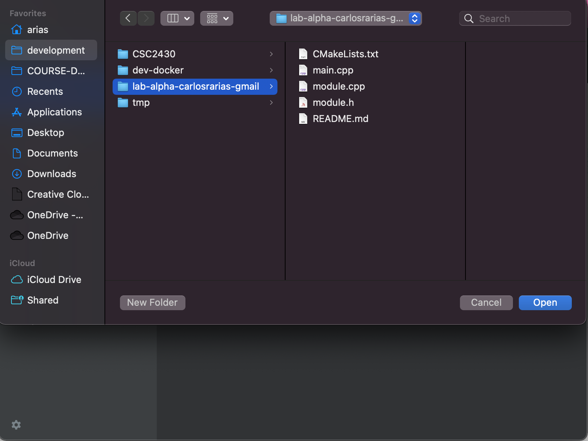          |
| 14   | Trust the project                                                                                                                                                                                                                                                                                                                                                                                                                 | 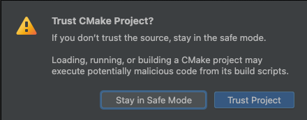        |
| 15   | Select "Reload CMake project on editing..." and then click OK                                                                                                                                                                                                                                                                                                                                                                     | 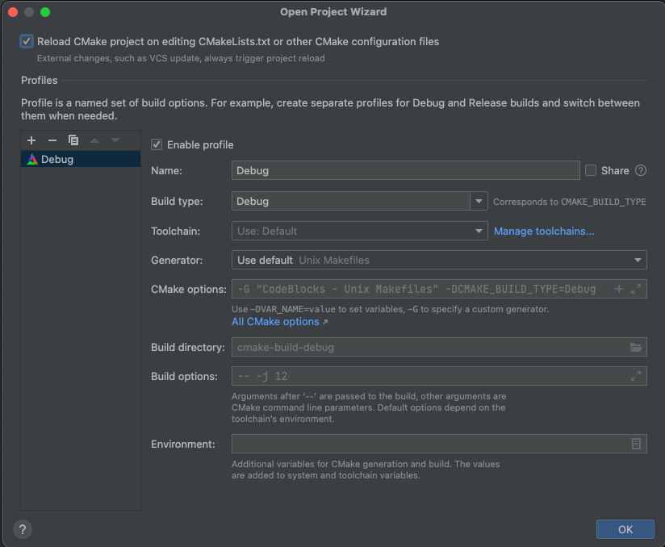 |
| 16   | Once your project is opened it would look like this:                                                                                                                                                                                                                                                                                                                                                                              | 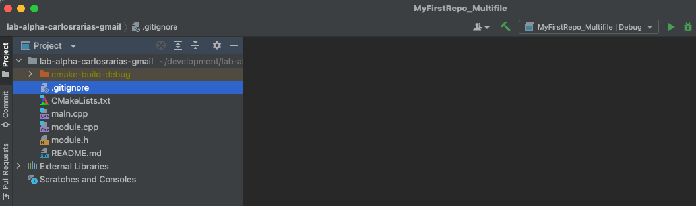       |
| 17   | If you double-click on the `main.cpp` file on the left it will show you the contents of that file:                                                                                                                                                                                                                                                                                                                                | 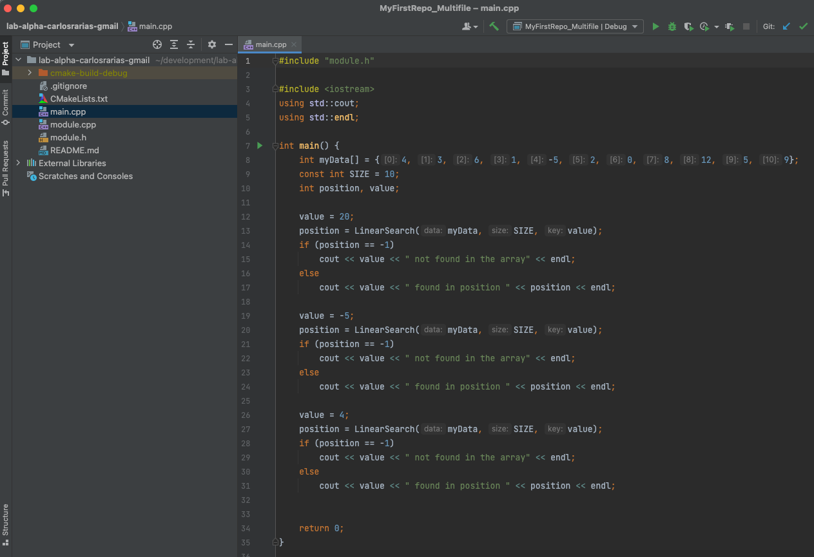          |
| 18   | Notice that your project has three source files: `main.cpp`, `module.h` and `module.cpp`. It does have other files, but source files have `cpp` and `h` extensions. `cpp` stands for C++ (C plus plus) and `h` stands for header file. Check out the contents of the module files. Note that there is a function declaration and a function definition. Where is the function declared? defined? what's the name of the function? | 
| 19   | Delete lines 12-32 from 'main.cpp', then modify the program in such a way that it produce the output shown here:                                                                                                                                                                                                                                                                                                                                  | 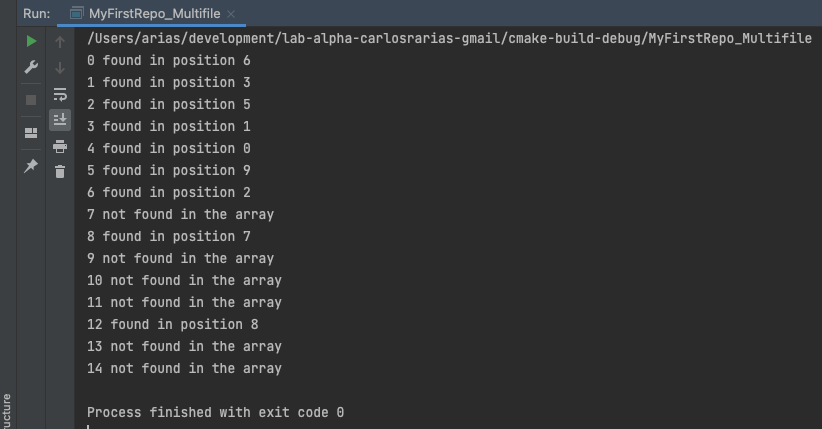        |
| 20   | Open GitHub Desktop and write a summary and description of your commit, this will help you remember what you committed, then click `Commit to master`. Notice that GitHub Desktop shows you the changes you did to your files. If more files were changed since your last commit, more files would appear in the column to the left. Once you press `Commit Changes` these version will be stored in your hard-drive.             | 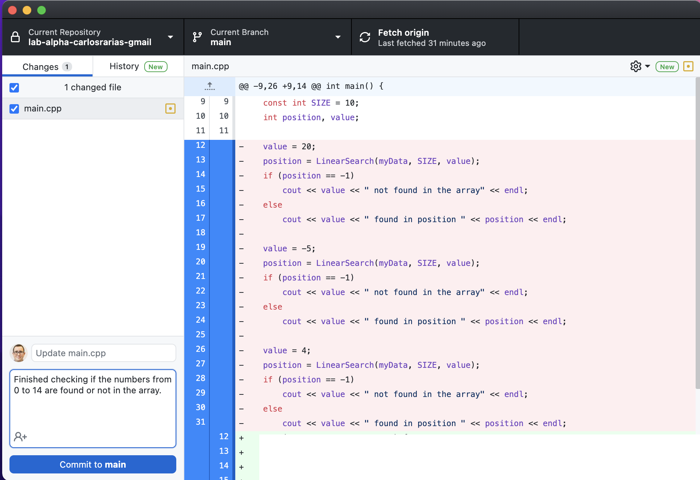            |
| 21   | Commit your changes using GitHub Desktop. This action will create a version of your source code in *your* computer, nothing is gone to the cloud yet.                                                                                                                                                                                                                                                                             | 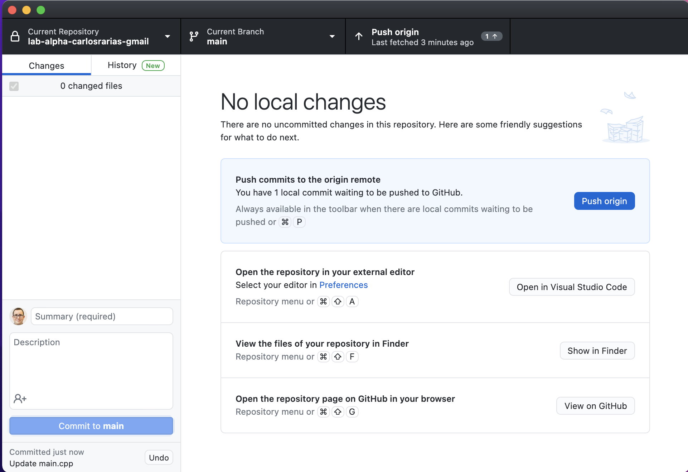           |
| 22   | Push your changes to GitHub using GitHub Desktop. This will send the changes to the cloud! You push by clicking the button that says `Push origin`                                                                                                                                                                                                                                                                                | 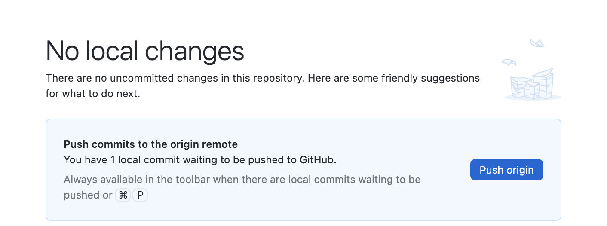           |
| 23   | Go to your repository online on GitHub and check your changes, you can do that by looking at the file `main` to see if it has the change you just made.                                                                                                                                                                                                                                                                           | 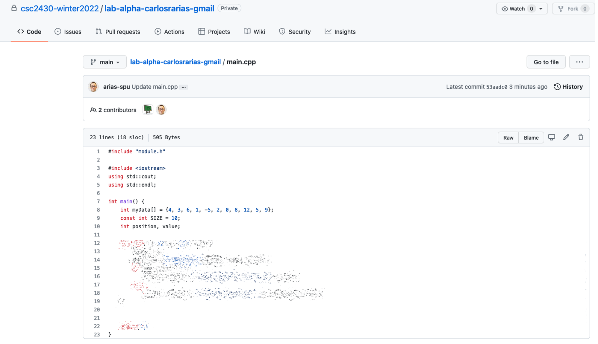          |
| 24   | You are done!                                                                                                                                                                                                                                                                                                                                                                                                                     ||

## Note
This is the process you will follow for *every* programming assigment in this class (and possibly in every programming assignment that Prof. Arias will give you).

